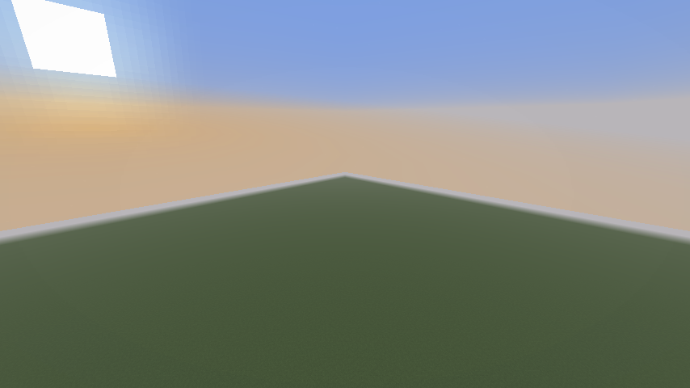
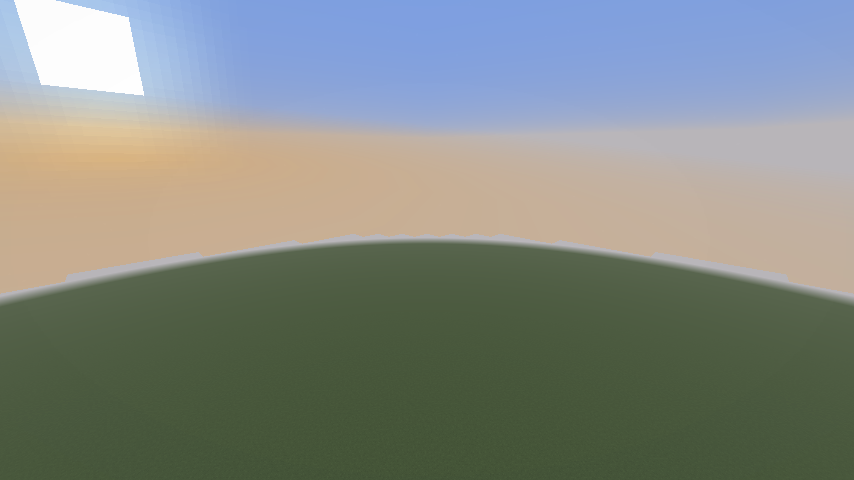

# Square Rendering

A Fabric mod for **Minecraft Java 1.21.11** that renders a square of chunks around the player's current chunk, with a toggle in Sodium's Video Settings.

At render distance **16**, the visible footprint includes a **33 × 33 grid**: 16 chunks in each horizontal direction plus the center chunk. Distance fog follows a square shape so the diagonal corners can be seen. Chunks outside the camera's view or hidden behind terrain still benefit from normal culling.

The same flat world, looking diagonally at render distance 16:

| Square Rendering enabled | Square Rendering disabled |
| --- | --- |
|  |  |

## Installation

Square Rendering has **one mod JAR and one mod ID**. Use the same JAR for both clients and servers.

| Install on | Required alongside Square Rendering | Behavior |
| --- | --- | --- |
| Client, singleplayer | Fabric Loader, Fabric API, Sodium | Full square rendering. The built-in server is handled automatically. |
| Client, multiplayer | Fabric Loader, Fabric API, Sodium | Square rendering of chunks the server supplies. Missing corner chunks require server support. |
| Fabric multiplayer server | Fabric Loader, Fabric API | Supplies full square views to players who enable the mod. Sodium is **not required on the server**. |

1. Install Fabric Loader for Minecraft **1.21.11**.
2. Install Fabric API **0.141.6+1.21.11** or a compatible later build for that Minecraft version.
3. On the client, install **Sodium 0.8.14+mc1.21.11**. The rendering mixins target this specific Sodium version.
4. Put `square-rendering-0.1.0+mc1.21.11.jar` in the instance's `mods` directory.
5. For full corners on a multiplayer server, put that **same file** in the Fabric server's `mods` directory as well.

The server continues to accept clients without Square Rendering. Their chunk-tracking behavior remains unchanged. A client with Square Rendering can also join servers without the mod; it cannot display chunks those servers never send. The mod does not cache old chunks or advertise a larger render distance to the server.

## Settings

Open **Options → Video Settings → Square Rendering** and change **Enable Square Rendering**.

- Enabled by default.
- Uses the normal render-distance setting; no second distance slider is needed.
- **Apply** saves the preference, updates server tracking when supported, and reloads resources and rendering. No game restart is needed.
- **Cancel/Undo** discards pending changes. **Reset** selects the enabled default.
- Disabling restores the original rendering and distance fog.

The client preference is stored in `config/square-rendering.json`:

```json
{
  "enabled": true
}
```

If editing this file by hand, restart the client to load the change. Missing settings default to enabled. Malformed files are preserved on startup and logged; the mod uses its default until the setting is saved again.

## How it works

For render distance `R`, a column is eligible when:

```text
max(abs(chunkX - playerChunkX), abs(chunkZ - playerChunkZ)) <= R
```

The square follows chunk boundaries, including at negative coordinates. Rotating the camera or moving within one chunk does not change its horizontal footprint.

Sodium's traversal receives enough range to reach the corners. A common collection hook then applies the exact square boundary to normal traversal, tree fallback, and immediate mesh updates. The original vertical distance limit, camera frustum, and terrain occlusion remain active.

Globally rendered block entities, including beacon beams, also respect the horizontal boundary, keeping the meshing border invisible.

Server support changes chunk tracking separately for each opted-in player. The radius respects both the client's requested distance and the server's view-distance limit. The server supplies one additional, invisible chunk border for edge meshing; this does not enlarge the rendered grid. Moving, changing distance, or disabling the option only sends and removes chunks whose membership changes.

Ordinary distance fog uses horizontal Chebyshev distance. Spherical environmental fog, such as water, lava, blindness, and darkness, is preserved. Simulation distance, ticking rules, and ordinary entity-tracking distances are unchanged. Seeing terrain in a chunk does not override the separate rules for seeing entities or running particular farm mechanics.

More terrain can be rendered than with the original circular cutoff, increasing GPU work, memory use, and multiplayer chunk traffic.

## Building

Install **JDK 21**, then run:

```sh
./gradlew build
```

On Windows:

```bat
gradlew.bat build
```

The single installable artifact is:

```text
build/libs/square-rendering-0.1.0+mc1.21.11.jar
```

The wrapper downloads Gradle automatically and verifies its distribution checksum. Dependency downloads require internet access on the first build. No separate server or sources JAR is published by this project.

| Component | Pinned development version |
| --- | --- |
| Java | 21 |
| Minecraft | 1.21.11, official Mojang mappings |
| Gradle Wrapper | 9.4.1 |
| Fabric Loom | 1.16.1 |
| Fabric Loader | 0.19.2 |
| Fabric API | 0.141.6+1.21.11 |
| Sodium | 0.8.14+mc1.21.11 |

Loom 1.16.1 is needed by the pinned dependencies; the initially considered Loom 1.15.5 rejects their build metadata. Common/server code and client code are separated into source sets and packaged together under `square-rendering`.

Development launches:

```sh
./gradlew runClient
./gradlew runServer --args nogui
```

These use separate `run/` and `run-server/` directories. A dedicated development server requires accepting Minecraft's EULA in its generated `eula.txt`.

## Tests

`./gradlew build` runs JUnit tests and the [Google Java Style](https://google.github.io/styleguide/javaguide.html) checks before producing the remapped JAR. The GitHub Actions workflow runs the same build and uploads that JAR.

Tests cover square counts and boundaries, randomized movement and resizing differences, support-border membership, transitions between vanilla and square views, config persistence and recovery, and targeted fog transformations.

The optional runtime harness is in a separate test source set and is **not distributed** in the mod JAR:

```sh
./gradlew -PgameTests runClientGameTest
```

On a headless Linux machine with Xvfb and Mesa installed:

```sh
xvfb-run -a env LIBGL_ALWAYS_SOFTWARE=1 ./gradlew -PgameTests runClientGameTest
```

This creates disposable test worlds, runs a client and temporary dedicated server, and accepts Minecraft's EULA for that temporary server. It checks real chunk delivery, live corner block updates, toggle changes, shader reloads, negative-coordinate movement, and distance changes. Runtime screenshots and logs are stored in the Gradle test run directory.

Add `-PsodiumExtra` to run with **Sodium Extra 0.8.3+mc1.21.11**, the version used for compatibility testing. This is a development runtime dependency and is not bundled. Newer Sodium Extra releases have not been validated with this build.

See [validation results](docs/validation.md) for the checks actually performed and remaining compatibility limits.

## Compatibility

- Fabric and Minecraft **1.21.11** only.
- Sodium **0.8.14** is required on the client. Sodium Extra is optional.
- Iris shader packs, custom fog-shape overrides, vanilla rendering without Sodium, and non-Fabric server implementations are outside the initial compatibility target.
- Other mods that change chunk tracking, terrain collection, or fog shaders may require additional integration. Circular Rendering changes the footprint in the opposite direction and should not be used alongside this mod.

## References and license

Implementation references: [Circular Rendering](https://github.com/Uniaball/circular-rendering/tree/1.21.11), [Sodium](https://github.com/CaffeineMC/sodium/tree/1.21.11/stable), [Fabric API](https://github.com/FabricMC/fabric-api/tree/1.21.11), and [Sodium Extra](https://github.com/FlashyReese/sodium-extra/tree/1.21.11/dev).

Square Rendering retains this repository's [GNU GPLv3 license](LICENSE). The referenced projects are separate dependencies or implementation references; their renderer code is not bundled into the mod.
